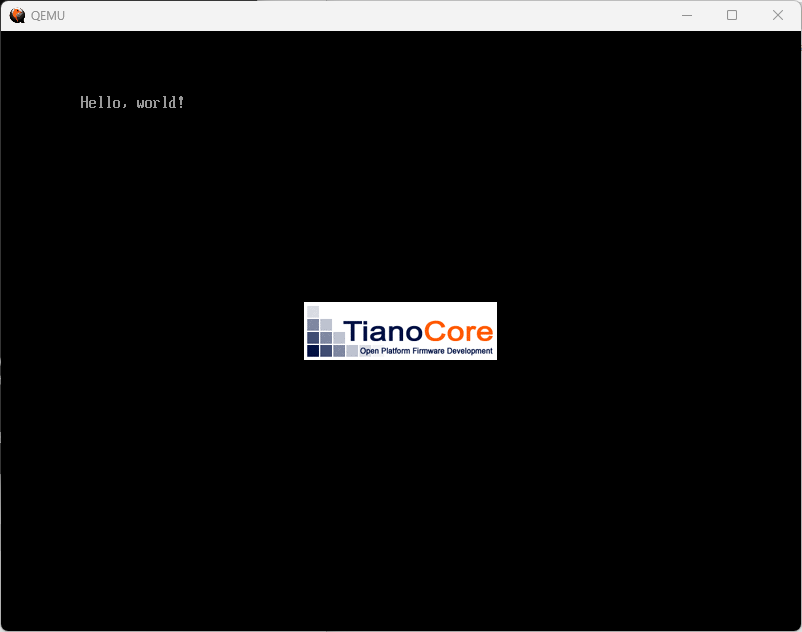

# day01
## A.00 開発環境のインストール
- MikanOSをビルドしたり、起動したりする開発環境の設定は以下のサイトを参照。  
  https://github.com/uchan-nos/mikanos-build
## A.01 WSLのインストール
- WSL（Windows Subsystem for Linux）は、Windows上にLinux環境を構築するソフト。
- WSLのインストール方法は以下を参照。  
　　https://learn.microsoft.com/ja-jp/windows/wsl/install-manual
## A.02 WSLでQEMUを使う準備
- パソコンの代わりに、ソフトウェアで仮想的なパソコンを再現できる「QEMU」というエミュレータを使う方法。
- WSLでQEMUを使うには、Windows側にXサーバをインストールしておく必要がある。
- XサーバとはLinuxでGUIを扱う中心的な部品。LinuxでGUIを扱うには、伝統的にX Windows Systemという仕組みが使われる。この仕組みを使うと、GUIアプリが動くマシンとその画面を表示するマシンを別にすることができる。
- Windowsに対応したXサーバの実装はいくつかあるが、VcXsrvが有力。
- VcXsrvをのダウンロードは以下のサイトから。  
  　 https://sourceforge.net/projects/vcxsrv/
## B.00 MikanOSの入手
- MikanOSのソースコードは、以下のサイトから入手可能。  
  　　https://github.com/uchan-nos/mikanos.git
- $HOME/workspaceは以下にクローンを作成する。  
```
mkdir $HOME/workspace
cd  $HOME/workspace
git clone https://github.com/uchan-nos/mikanos.git
```
- MikanOSのソースコードには、各時点のバージョンにタグが付与されている。タグはosbook_dayXXの形式で名前付けされている。
- タグの一覧を確認するコマンドは以下。（タグ一覧から抜ける場合はqを押す）
```
cd $HOME/workspace/mikanos
git tag -l
```
- この中から希望する時点のソースコードを得ることができる。例えば、osbook_day26aの内容を得るためには次のコマンドを実行する。
```
git checkout osbook_day26a
```
## 1.1 ハローワールド
- バイナリで起動後に"Hallo, World!"が表示されるプログラムを作成する。
- バイナリファイルを作成するには、バイナリエディタを使用する。WSL上のUbuntuで行う場合は、Windows用のバイナリエディタを使う。
- Windows用のバイナリエディタはいくつかあるが、Binary Editor Bzが有力。
- Binary Editor Bzでコードを作成し、BOOTX64.EFIの名前で保存する。  
　　https://github.com/RRRYOOO/OS/blob/main/mikanOS/day01/BOOTX64.efi
## 1.4 エミュレータでのやり方
-「QEMU」というエミュレータを使って表示する方法について記載する。
- ここでは事前に「A.00 開発環境のインストール」「A.01 WSLのインストール」「A.02 WSLでQEMUを使う準備」を済ませておく必要がある。
- QEMUでBOOTX64.EFIを起動するには2段階の処理が必要。
   - BOOTX64.EFIを含んだディスクイメージを作成する。
     ```
     qemu-img create -f raw disk.img 200M
     mkfs.fat -n 'MIKAN OS' -s 2 -f -R 32 -F 32 disk.img
     mkdir -p mnt
     sudo mount -o loop disk.img mnt
     sudo mkdir -p mnt/EFI/BOOT
     sudo cp BOOTX64.EFI mnt/EFI/BOOTBOOTX64.EFI
     sudo umount mnt
     ```
     qemu-imgコマンドで200MBの空のファイルを作ってFAT形式でフォーマットし、そこにBOOTX64.EFIファイルを書き込むという流れ。最終的にBOOTX64.EFIを含んだdisk.imgというファイルが作成される。
   - 次にQEMUにそのディスクイメージを読み込ませて起動する。
     ```
     qemu-system-x86_64 \
       -drive if=pflash,file=$HOME/osbook/devenv/OVMF_CODE.fd \
       -drive if=pflash,file=$HOME/osbook/devenv/OVMF_VARS.fd \
       -hda disk.img
     ```
- これらの長い処理をまとめて実行するスクリプト「run_qemu.sh」は、開発環境に同梱されている。以下のコマンドで実行可能。
  ```
  $HOME/osbook/devenv/run_qemu.sh BOOTX64.EFI
  ```
- 実行結果は以下の通り。
    
## 1.7 UEFI BIOSによる起動
- BOOTX64.EFIを所定の場所に保存してPC(またはエミュレータ)を起動すると、「Hello, world!」が表示された。これはBIOSがBOOTX64.EFIの中にある機械語を実行したからである。
- BIOS(Basic Input Output System)は、PCの電源を入れて最初に実行されるファームウェアと呼ばれるプログラムである。BIOSは、基本的な入出力機能、特にOS起動前にコンピュータ内部を初期化したり、OS(ブートローダ)をストレージから読み出す機能を提供する。
- UEFI(Unified Extensible Firmware Interface)という標準仕様にしたがって作られたBIOSを「UEFI BIOS」と言う。
- 起動後にBOOTX64.EFIが実行される流れは以下の通り。
  - コンピュータの電源を入れるとCPUはBIOSの実行を開始する。
    - CPUがBIOSに格納された機械語プログラムを実行する。
  - BIOSは、パソコン本体や周辺機器を初期化する。
    - CPUの動作モードを設定したり、PCIデバイスを検出し設定したりする。
  - パソコンに接続されたストレージ(HDD、SSD、USB、DVDなど)を検索して実行可能ファイルを探す。
    - BOOTX64.EFIのようなファイルが特定のディレクトリに存在するのを見つけると、そのファイルをメインメモリに読み込む。
  - BIOSは自分自身の実行を中断し、読み込んだプログラムの実行を開始する。
    - UEFI BIOSが実行してくれるプログラムのことをUEFIアプリケーションと呼ぶ。
## 1.9 C言語でハローワールド
- バイナリエディタで打ち込んだ機械語プログラムよ同じ動きをするC言語プログラムを作成する。
- すでに開発環境をインストールしていれば$HOME/osbook/day01c/hello.cにソースコードがある。
- プログラムの本体となる箇所はEfiMain()関数になる。  
  ### hello.c
  ```
  EFI_STATUS EfiMain(EFI_HANDLE        ImageHandle,
                   EFI_SYSTEM_TABLE  *SystemTable) {
    SystemTable->ConOut->OutputString(SystemTable->ConOut, L"Hello, world!\n");
    while (1);
    return 0;
  }
  ```
