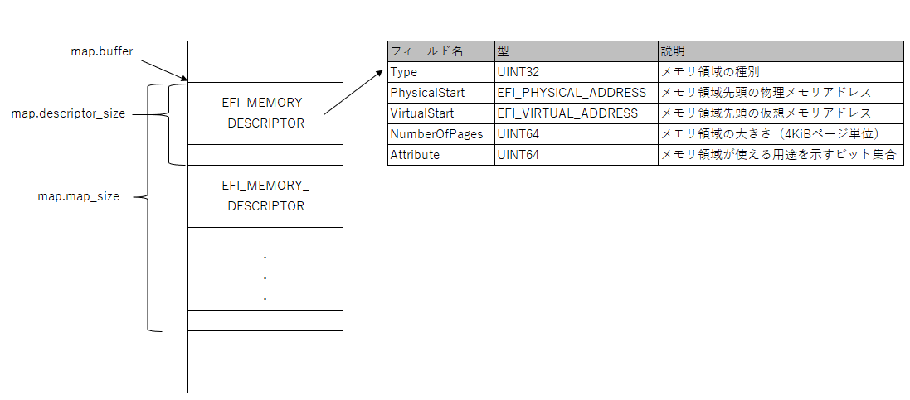

# day02
## 2.1 EDK2入門
- EDK2は、UEFI BIOS自体の開発にも、UEFI BIOS上で動くアプリケーションの開発にも使用できる開発キットである。
- EDK2は、開発環境のインストールが完了していれば、すでに$HOME/edk2にダウンロードされている。
- EDK2の主なファイル構成は以下である。
```
edk2/
  edksetup.sh       環境変数設定用スクリプト
  Conf/
    target.txt      ビルド設定
    tools_def.txt   ツールチェーンの設定
  MdePkg/           EDKの中心的ライブラリのパッケージディレクトリ
  ...Pkg/           その他のパッケージディレクトリ
```
- edksetup.shは、EDK2のビルドコマンドが動くようにするための準備スクリプトである。ビルドを行う前に実行する。
- Confディレクトリには、何をビルドするかを設定するtarget.txtとビルドに用いるコンパイラを設定するtools_def.txtを配置する。これらのファイルはedksetup.shを初めて実行したときにひな形が生成される。
- MdePkgは、他のプログラムからよく利用される基本ライブラリである。
- AppPkgは、UEFIアプリケーションをいくつか含んでいる。
- OvmfPkgは、UEFI BIOSのオープンソース実装であるOVMFが収められている。
## 2.2 EDK2でハローワールド（osbook_day02a）
- 第1章で作成したC言語のハローワールドをEDK2ライブラリを使って書き直してみる。
- 今後、USBメモリからメインメモリにOSを読みこむのに使うブートローダに進化させるため、「MikanLoader」という名前でアプリケーションを作成していく。
- ソースコードはMikanOSのリポジトリのosbook_day02aタグである。ファイルの構成は以下。
  ```
  $HOME/workspace/mikanos/MikanLoaderPkg/
    MIkanLoaderPkg.dec    パッケージ宣言ファイル
    MIkanLoaderPkg.dsc    パッケージ記述ファイル
    Loader.inf            コンポーネント定義ファイル
    Main.c                ソースコード
  ```
#### <Loader.inf>
```
 [Defines]
   <中略>
   ENTRY_POINT          =  UefiMain
```
- 「Loader.inf」のENTRY_POINT設定には、このUEFIアプリケーションのエントリポイントを記載する。
- エントリポイントとは、起動時に最初に実行される関数のことである。通常のCプログラムではmain()という名前は固定だが、EDK2ではUEFIアプリケーションごとに自由にエントリポイント名を指定できる。
#### <Main.c>
```
#include  <Uefi.h>
#include  <Library/UefiLib.h>

EFI_STATUS EFIAPI UefiMain(
    EFI_HANDLE image_handle,
    EFI_SYSTEM_TABLE *system_table) {
  Print(L"Hello, Mikan World!\n");
  while (1);
  return EFI_SUCCESS;
}
```
- ハローワールドプログラムの本体はMain.cファイルである。
- 第1章のhello.cで書いたものの大部分はEDK2のライブラリが提供しているため、Main.cでは#includeでそれを取り込むだけでよくなったためシンプルになった。
- Uefi.hはEDK2に含まれるヘッダファイルで、実体は$HOME/edk2/MdePkg/Include/Uefi.hにある。
- Print()関数は、C言語のprintf()関数と似た、文字列の表示関数である。printf()と違うのは引数にワイド文字を渡さなければならないところである。文字列の前にLと書いてるのが、これはワイド文字から構成された文字列を表現するためのやり方である。UEFIで文字表示するにはワイド文字にすると覚えておくこと。
- 上記のソースコードをビルドする手順を以下に示す。
  - MikanOSのリポジトリでビルドしたいバージョンを呼び出しておく。
    - git checkoutは、指定したバージョン(タグ)のソースコードを呼び出し、ファイルとして配置するコマンドである。 
    ```
    cd $HOME/workspace/mikanos
    git checkout osbook_day02a
    ```
  - MikanLoaderPkgにシンボリックリンクを張る。
    - $HOME/edk2の中に、$HOME/workspace/mikanos/MikanLoaderPkgを指すシンボリックリンクを作成する。
    ```
    cd $HOME/edk2
    ln -fs $HOME/workspace/mikanos/MikanLoaderPkg ./
    ```
  - edksetup.shを読み込む。
    - sourceコマンドでedksetup.shファイルを読み込むと、Conf/target.txtファイルが自動的に生成される。
    ```
    source edksetup.sh
    ```
  - 生成されたConf/target.txtを編集する。
    - Conf/target.txtでMikanLoaderPkgをビルド対象として指定する。以下の表のように設定する。  
      | 設定項目 | 設定値 |
      ----|---- 
      | ACTIVE_PLATFORM | MikanLoaderPkg/MikanLoaderPkg.dsc |
      | TARGET | DEBUG |
      | TARGET_ARCH | X64 |
      | TOOL_CHAIN_TAG | CLANG38 |
  - 設定が完了したらEDK2付属のbuildコマンドでビルドする。
    - ビルドが完了すると、$HOME/edk2/Build/MikanLoaderX64/DEBUG_CLANG38/X64/loader.efiに目的のファイルが出力される。
      ```
      cd $HOME/edk2
      build
      ```
  - 出力されたファイルをBOOTX64.EFIにリネイムして以下のコマンドで実行する。
    - QEMU上に「Hello,Mikan World!」 と表示される。
      ```
      $HOME/osbook/devenv/run_qemu.sh BOOTX64.EFI
      ```
  - 実行結果は以下の通り。
    
## 2.4 メモリマップ
- メモリマップは、メインメモリのどの部分がどんな用途で使われているかが記載されている。
- メモリマップにおいて、アドレスは「PhysicalStart」列にある数値である。その値は、32ビットCPUで0から43億程度まである。
- メモリマップの「Type」列にはその領域が何に使われているか（あるいは、使われていない空き領域か）を示している。
- メモリマップの中の「NumberOfPages」列は、メモリ領域の大きさをページ単位で表した数値が入る。UEFIのメモリマップにおける1ページの大きさは4KiB（4*1024バイト）。
- 実際のメモリマップには、歯抜けが存在しているため、PhysicalStartにNumberOfPages*4KiBを足しても次の行のPhysicalStartにはならない場合があることに注意する。
  
| PhysicalStart | Type                  | NumberOfPages | 
| ------------- | --------------------- | ------------- | 
| 0x00000000    | EfiBootServicesCode   | 0x1           | 
| 0x00001000    | EfiConventionalMemory | 0x9F          | 
| 0x00100000    | EfiConventionalMemory | 0x700         |
| 0x00800000    | EfiACPIMemoryNVS      | 0x8           |
| ・・・        | ・・・                 | ・・・        |
## 2.5 メモリマップの取得（osbook_day02b）
- UEFIの機能を使ってメモリマップを取得するプログラムは$HOME/workspace/mikanos/MikanLoaderPkg/Main.c(osbook_day02b)にある。
#### <Main.c>
```
EFI_STATUS GetMemoryMap(struct MemoryMap* map)
{
  if (map->buffer == NULL)
  {
    return EFI_BUFFER_TOO_SMALL;
  }
  
  map->map_size = map->map->buffer_size;
  return gBS->GetMemoryMap(
      &map->map_size,
      (EFI_MEMORY_DESCRIPTOR*)map->buffer,
      &map->map_key,
      &map->descriptor_size,
      &map->descriptor_version);
}
```
- UEFIは大きく分けて、OSを駆動するために必要な機能を提供するブートサービスと、OS起動前\起動後のどちらでも使える機能を提供するランタイムサービスから構成される。
- メモリ管理関連の機能はブートサービスに含まれるので、ブートサービスを表すグローバル変数gBSを使用する。ランタイムサービスに含まれる機能を使用する場合はgRTというグローバル変数を使用する。
#### < gBS->GetMemoryMap()>
```
EFI_STATUS GetMemoryMap(
  IN OUT UINTN *MemoryMapSize,
  IN OUT EFI_MEMORY_DESCRIPTOR *MemoryMap,
  OUT UINTN *MapKey,
  OUT UINTN  *DescriptorSize,
  OUT UINT32  *DescriptorVersion);
```
- IN、OUTはそれぞれ関数への入力用、関数からの出力用であることを意味する。（IN、OUTはコンパイル時に空文字列に置き換えられるため、コンパイル結果には影響しない。）
- gBS-＞GetMemoryMap()は、関数呼び出し時点のメモリマップを取得し、引数MemoryMapで指定されたメモリ領域に書き込む。正常にメモリマップが取得できるとEFI_SUCCESSを返す。
- 1番目の引数のMemoryMapSizeは、入力としてはメモリマップ書き込み用のメモリ領域の大きさを設定する。出力としては実際のメモリマップの大きさが設定される。
- 2番目の引数のMemoryMapは、メモリマップ書き込み用のメモリ領域の先頭ポインタを設定する。
- 3番目の引数のMapKeyは、メモリマップを識別するための値を書き込む変数を指定する。この値は後でgBS->ExitBootServices()を呼び出すときに必要になる。
- 4番目の引数のDescriptorSizeは、メモリマップの個々の行を表すメモリディスクリプタのバイト数を表す。
- 5番目の引数のDescriptorVersionは、メモリディスクリプタの構造体のバージョン番号を表す。
- MemoryMapで指し示されるメモリ領域に書き込まれるデータの構造は、EFI_MEMORY_DESCRIPTOR構造体の配列となっている。メモリマップ全体の大きさはMemoryMapSizeバイトで、要素はDescriptorSizeバイト間隔で配置される。
- EFI_MEMORY_DESCRIPTOR構造体の定義を以下の表に示す。この定義はEDK2のMdePkg/Include/Uefi/Uefispec.hというヘッダファイルの中に、UEFIの規定所に沿って書かれた構造体定義がある。
  
#### <メモリマップ構造体（Main.c）>
```
struct MemoryMap
{
  UINTN buffer_size;
  VOID* buffer;
  UINTN map_size;
  UINTN map_key;
  UINTN descriptor_size;
  UINT32 descriptor_version; 
}
```
- サンプルプログラムではMemoryMapという構造体を独自に定義し、メモリディスクリプタを書き込むためのバッファ全体のサイズやgBS->GetMemoryMap()で取得したディスクリプタサイズなどを記録できるようになっている。
## 2.6 メモリマップのファイルへの保存
#### <メイン関数の更新部分（Main.c）>
```
CHAR8  memmap_buf[4096 * 4];
struct MemoryMap memmap = {sizeof(memmap_buf), memmap_buf, 0, 0, 0, 0};
GetMemoryMap(&memmap);

EFI_FILE_PROTOCOL* root_dir;
OpenRootDir(image_handle, &root_dir);

EFI_FILE_PROTOCOL* memmap_file;
root_dir->Open(
    root_dir, &memmap_file, L"\\memmap",
    EFI_FILE_MODE_READ | EFI_FILE_MODE_WRITE | EFI_FILE_MODE_CREATE, 0);

SaveMemoryMap(&memmap, memmap_file);
memmap_file->Close(memmap_file);
```
- このプログラムに出てくるOpenRootDir()やroot_dir->Open()の関数は、簡単に言えば書き込み先のファイルを開く関数である。この関数を実行すると、ファイルが書き込みモードで開かれる。（存在しなければ新規作成される。）開いたファイルをSaveMemoryMap()に渡し、そこへ先ほど取得したメモリマップを保存する。
- メモリマップはかなり大きくなることがある。16KiB(4096 * 4)で足りないことがあれば、もっと余裕のある大きさに増やしてみる等の修正を行うこと。
#### <SaveMemoryMap()（Main.c）>
```
EFI_STATUS SaveMemoryMap(struct MemoryMap* map, EFI_FILE_PROTOCOL* file)
{
  CHAR8 buf[256];
  UINTN len;

  CHAR8* header =
      "Index, Type, Type(name), PhysicalStart, NumberOfPages, Attribute\n";
  len = AsciiStrLen(header);
  file->Write(file, &len, header);

  Print(L"map->buffer = %08lx, map->size = %08lx\n",
      map->buffer, map->map_size);

  EFI_PHYSICAL_ADDRESS iter;
  int i;
  for (iter = (EFI_PHYSICAL_ADDRESS)map->buffer, i = 0;
       iter < (EFI_PHYSICAL_ADDRESS)map->buffer + map->map_size;
       iter += map->descriptor_size, i++)
  {
    EFI_MEMORY_DESCRIPTOR* desc = (EFI_MEMORY_DESCROPTOR*)iter;
    len = AsciiSPrint(
        buf, sizeof(buf),
        "%u, %x, %-ls, %08lx, %lx, %lx\n",
        i, desc->Type, GetMemoryTypeUnicode(desc->Type),
        desc->PhysicalStart, desc->NumberOfPages,
        desc->Attribute & 0xffffflu);
    file->Write(file, &len, buf);
  }

  return EFI_SUCCESS;  
}
```
- SaveMemoryMap()は、引数で与えられたメモリマップ情報をCSV形式でファイルに書き出す。処理の前半にあるfile->Write()によってヘッダー行を出力する。
- for文の繰り返し処理に関する変数はiとiterである。iはメモリマップの行番号を表すカウンタで、iterはメモリマップの各要素（メモリディスクリプタ）のアドレスを表す。iterの初期値はメモリマップの先頭、すなわちメモリディスクリプタを指していて、更新式によって隣接するメモリディスクリプタを指すようになる。
   ```
   len = AsciiSPrint(
       buf, sizeof(buf),
       "%u, %x, %-ls, %08lx, %lx, %lx\n",
       i, desc->Type, GetMemoryTypeUnicode(desc->Type),
       desc->PhysicalStart, desc->NumberOfPages,
       desc-<Attribute & 0xffffflu);
   ```
   - キャストしたdescを利用して、メモリディスクリプタの値を文字列に変換数する。
   - AsciiSPrint()はEDK2に用意されているライブラリ関数で、指定したchar配列に成形した文字列を書き込んでくれる。
   - GetMemoryTypeUnicode()は、Main.cに定義している関数で、メモリディスクリプタのタイプ値からタイプ名を取得して返す。
   ```
   file->Write(file, &len, buf);
   ```
   - EFI_FILE_PROTOCOLが提供するWrite()を使って、ファイルに文字列を書き出す。
## 2.7 メモリマップの確認
- 実際にメモリマップを確認する。
- MikanLoaderPkgをビルドする。
  ```
  cd $HOME/workspace/mikanos
  git checkout osbook_day02b
  cd $HOME/edk2
  source edksetup.sh
  build
  ```
- $HOME/esk2/Build/MikanLoaderX64/DEBUG_CLANG38/X64/にビルドしてできたLoader.efiファイルをBOOTX64.EFIにリネイムしてQEMU上で起動させる。
  ```
  $HOME/osbook/devenv/run_qemu.sh BOOTX64.EFI
  ```
- 実行結果は以下の通り。
    
- run_qemu.shスクリプトを使ってQEMUを起動させると、カレントディレクトリにdisk.imgというファイルが作られる。これはｍディスクイメージと呼ばれるファイルで、マウントすることで中身を見ることができる。
- マウントとは、Linuxの基本操作の1つで、ファイルシステムを開いて使えるようにする操作である。USBメモリやネットワークドライブなど、外部記憶装置をLinuxで使うときにする操作であるが、今回のようにディスクイメージを開いて読み書きをするような用途にも使える。
  ```
  mkdir -p mnt
  sudo mount -o loop disk.img mnt
  ls mnt
  ```
- ls mntするとディスクイメージの中身が表示されるはずである。EFIディレクトリの他にmemmapというファイルがあるはずだが、これはBOOTX64.EFIによりファイルに保存されたメモリマップファイルである。
- catコマンドで中身を確認すると、memmapがCSV形式で表示される。
  ```
  cat mnt/memmap
  ```
- 実行結果は以下の通り。
    
- 一通り確認が終わったら、ディスクイメージをアンマウントしておく。
  ```
  sudo umount mnt
  ```
