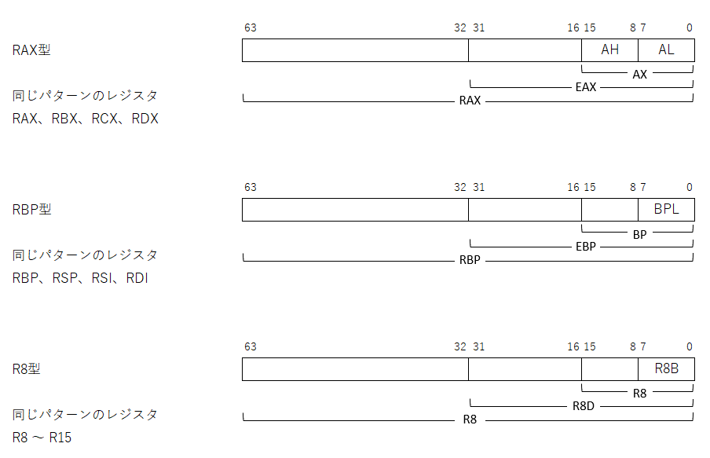
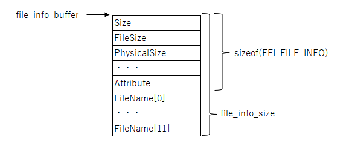
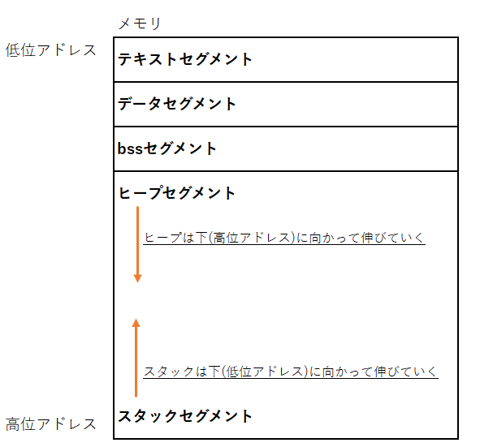
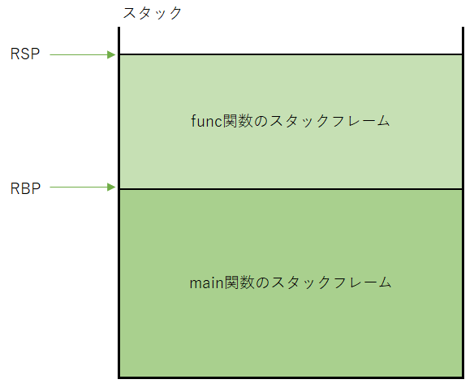

# day03
## 3.1 QEMUモニタ
- QEMUモニタを使ったデバッグ方法を記載する。
- QEMUモニタは、QEMUの標準機能で、CPUの設定を表示したりメモリの中身を読み書きをすることができる。
- QEMUモニタはを使うには、QEMUが起動した後にrun_qemu.shを実行したターミナルに戻る。  
  （QEMUモニタをターミナルから使えるようにしてある。）
    
## 3.1.1 QEMUモニタを使ったレジスタ値の確認
- QEMUモニタで以下のコマンドを実行すると、CPUの各レジスタの現在の値が表示される。
  ```
  info registers
  ```
   
## 3.1.2 QEMUモニタを使ったメモリダンプ方法
- メインメモリの中で指定したアドレス付近の値を表示する、メモリダンプの方法を記載する。
- メモリダンプを実施するにはxコマンドを使う。Xコマンドの書式は以下の通り。
  ```
  (qemu) x /fmt addr
  ```
  - /fmtに指定された書式にしたがってaddrを先頭とするメモリ領域の値を表示する。  
    /fmtは、/[個数][フォーマット][サイズ]と分解できる。
  - [個数]は、何個分表示するかを指定する。
  - [フォーマット]は、読み出した値をどのような形式で表示するかを以下の種類から選択できる。
    | オプション | 表示形式 | 
    | ------------- | -------- | 
    | x | 16進数表示 |
    | d | 10進数表示 |
    | i | 機械語命令を逆アセンブルして表示 |
  - [サイズ]は、何バイトを1単位として解釈するかを指定する。
  
    | オプション | 単位 | 
    | ------------- | -------- | 
    | b | 1バイト |
    | h | 2バイト |
    | w | 4バイト |
    | g | 8バイト |
- 0x067ae4c4から4バイトを16進数で表示する場合は、以下のようにコマンドを実行する。
  ```
  (qemu) x /4xb 0x067ae4c4
  00000000067ae4c4: 0xeb 0xfe 0x66 0x90
  ```
  - 上記はおそらく機械語命令であると思われる。
    試しに2命令分を逆アセンブルして表示してみる。
    ```
    (qemu)bx /2i 0x067ae4c4
    00000000067ae4c4:  jmp      0x67ae4c4
    00000000067ae4c6:  xchg     %ax,%ax
    ```
      - 「jmp 0x67ae4c4」は、0x67ae4c4にジャンプするという命令であるが、0x67ae4c4はその命令がある場所そのものであるので、結局は同じ場所をぐるぐると回ることになる。実はこのアセンブリ命令はwhile(1);をコンパイルしたものになる。
## 3.2 レジスタ
- CPUに内蔵されたレジスタについて記載する。
- CPUには、一般的に汎用レジスタと特殊レジスタが搭載されている。
- 汎用レジスタは、一般の演算に使用するレジスタである。
- 特殊レジスタは、その目的は様々で、CPUの設定を行うためのものやタイマなどのCPUに内蔵された機能を制御するためのものもある。
### 3.2.1 汎用レジスタ
- 汎用レジスタの主目的は、値を記憶することである。
- CPUの外部にあるメインメモリと対照的に、レジスタは容量が小さく読み書きが高速な点が特徴である。  
  容量については、メインメモリは16GB（2の34乗バイト）程度あるのに対して、x86-64アーキテクチャの汎用レジスタは128B（2の7乗）しかない。  
  読み書き速度については、メインメモリはだいたい100ナノ秒くらいかかるのに対して、レジスタは待ち時間なく書き込み可能である。（2GHzで動くCPUであれば0.5ナノ秒程度）  
- x86-64の汎用レジスタは以下の16個である。
  - RAX、RBX、RCX、RDX、RBP、RSI、RDI、RSP、R8～R15
- これらの汎用レジスタは、CPUの演算対象に指定できる。
  例えば、加算命令addには次のように2つのレジスタを指定できる。  
  ```
  add  rax,  rbx
  ; オペコード  オペランド1,  オペランド2
  ```
- 一般的にx86-64の演算命令は2つのオペランド(引数)を取り、左側が書き込み先、右側が読み込み元になる。
- x86-64の汎用レジスタのサイズはすべて8バイト(=64ビット)である。
- charやunit16_tといった8バイトより小さいサイズの型の変数（変数はメインメモリに配置される）をレジスタに読み出して使う場合には、汎用レジスタを小さなレジスタとしてアクセスできるような仕組みになっている。  
  例えば、AXレジスタはRAXレジスタの下位16ビットを表す名前になっていて、AXを読み書きすることでRAXの下位16ビットを読み書きできる。  
    
### 3.2.1 特殊レジスタ
- 特殊レジスタの役割はレジスタによってそれぞれで、汎用レジスタ同様に値を記憶するものもあれば、汎用レジスタにはない機能を持つものもいる。代表的なものを記載する。
- RIPは、次に実行する命令のメモリアドレスを保持していて、命令の実行に伴って変化する。  
  演算系の命令を実行した場合は、次の命令を指すように増えるだけだが、jmpやcallのような分岐命令の場合は、オペランドで指定されたアドレスがRIPに書き込まれる。
- RFLAGSは、様々なフラグを集めたレジスタで、各ビット毎に異なる役割を持つ。例えば、ビット0がキャリーフラグ(CF)、ビット6がゼロフラグ(ZF)である。  
  CFは加算がオーバーフローした場合に1になる。ZFは命令の実行結果が0になると1になる。  
  フラグレジスタは、演算系の命令やcmpなどのフラグレジスタに影響を与える命令の直後に、jzやcmovzなどのフラグレジスタの内容によって動作が変わる命令を配置する。
- CR0は、CPUの重要な設定を集めたレジスタである。  
  CR0のビット0(PE)に1を書き込むと、CPUは保護モードに遷移する。ビット31(PG)に1を書き込むとページングが有効になる。
## 3.3 初めてのカーネル（osbook_day03a）
- 今回は、ブートローダはUEFIアプリとして、カーネルはELFバイナリとして別々のファイルとして開発し、ブートローダからカーネルを呼び出す形式にする。
- 最初に作成するカーネルは、何もしないで永久ループするプログラムとする。
- ここで定義するKernelMain()がブートローダから呼び出される関数になるが、このような関数をエントリポイントと呼ぶ。
#### <main.cpp>
  ```
  extern "C" void KernelMain() {
    while(1) __asm__("hlt");
  }
  ```
  - 「extern "C"」は、C言語形式で関数を定義することを意味する。C++では、引数の個数や方が異なる同名の関数を定義できるように名前修飾（マングリング）が行われる。名前修飾とは、宣言した関数名を関数名に引数の情報が結合された名前に変換する仕組みのことである。  
    C言語のプログラムからC++で定義した関数を呼び出すには、名前修飾された関数名を使う必要があるが、難しい名前になるため非現実的である。そのため、extern "C"を関数定義の先頭に付けることで名前修飾を防ぎ、通常の関数名で呼び出し可能となる。
  - 「__asm__()」は、インラインアセンブラのための記法で、C言語プログラムの中にアセンブリ言語の命令を埋め込むときに使う。「__asm__("hlt")」は、hlt命令を埋め込むという使い方になる。
  - hlt命令は、CPUを停止させる命令で、CPUが省電力な状態になる。hltを実行せずに永久ループすると、CPUが100%の使用率になる。hltにより、CPUは省電力モードになり動作が止まるが、割り込みがあると動作が再開する。
- このソースコードからカーネルファイルを作るには以下のようにコンパイルとリンクを行う。
  ```
  cd $HOME/workspace/mikanos
  git checkout osbook_day03a
  cd kernel
  clang++ -O2 -Wall -g --target=x86_64-elf -ffreestanding -mno-red-zone -fno-exceptions -fno-rtti -std=c++17 -c main.cpp
  ld.lld --entry KernelMain -z norelro --image-base 0x100000 --static -o kernel.elf main.o
  ```
  - 1行目では、clang++コマンドでソースコードをコンパイルし、オブジェクトファイルを作る。
  - コンパイラに指定したオプションの意味は以下の通り。
    | オプション | 意味 | 
    | ------------- | -------- | 
    | -O2 | レベル2の最適化を行う。 |
    | -Wall | 警告をたくさん出す。 |
    | -g | デバッグ情報付きでコンパイルする。 |
    | --target=x86_64-elf | x86_64向けの機械語を生成する。出力ファイル形式はELFとする。 |
    | -ffreestanfing | フリースタンディング環境向けにコンパイルする。 |
    | -mno-red-zone | Red Zone機能を無効にする。 |
    | -fno-exceptions | C++の例外機能を使わない。 |
    | -fno-rtti | C++の動的型情報を使わない。 |
    | -srd=c++17 | C++のバージョンをC++17とする。 |
    | -c | コンパイルのみする。リンクはしない。 |
    - -ffreestandingがフリースタンディング環境向けにコンパイルを行うための指定。C++の動作環境は大きく2種類、ホスト環境（hosted environment）とフリースタンディング環境（freestanding environment）が規定されている。ホスト環境はOSの上で動くプログラムのための環境で、フリースタンディング環境はOSがない環境のことである。OS開発の場合は、フリースタンディング環境をセレクトする必要がある。
    - -mno-red-zone、-fno-exceprtions、-dno-rttiはOSを作るときにはとりあえずつけておくといいオプション群である。
  - 次にリンカld.lldによってオブジェクトファイルから実行可能ファイルを作る。
  - リンカに指定したオプションは以下の通り。
    | オプション | 意味 | 
    | ------------- | -------- | 
    | --entry KernelMain | KernelMain()をエントリポイントとする。 |
    | -z norelro | リロケーション情報を読み込み専用にする機能を使わない。 |
    | --image-base 0x100000 | 出力されたバイナリのベースアドレスを0x100000番地とする。 |
    | -o kernel.elf | 出力ファイル名をkernel.elfとする。 |
    | --static | 静的リンクを行う。 |
- このカーネルファイルをブートローダから起動させるには、ブートローダがこのファイルをメインメモリに読み出す必要がある。  
  今回は、ブートローダの実行ファイルLoader.efiとカーネルの実行ファイルKernel.elfを両方ともUSBメモリに書き込んでおき、UEFIの機能を使ってブートローダからカーネルを読み出して起動させる。
- ブートローダでカーネルファイルを読み込む流れは、ファイルを開き、ファイル全体を格納できる十分なメモリを確保し、ファイルの内容を読み取る手順になっている。
#### <Main.c>
  ```
  EFI_FILE_PROTOCOL* kernel_file;
  root_dir->Open(
      root_dir, &kernel_file, L"\\kernel.elf",
      EFI_FILE_MODE_READ, 0);
  
  UINTN file_info_size = sizeof(EFI_FILE_INFO) + sizeof(CHAR16) * 12;
  UINT8 file_info_buffer[file_info_size];
  kernel_file->GetInfo(
      kernel_file, &gEfiFileInfoGuid,
      &file_info_size, file_info_buffer);
  
  EFI_FILE_INFO* file_info = (EFI_FILE_INFO*)file_info_buffer;
  UINTN kernel_file_size = file_info->FileSize;
  
  EFI_PHYSICAL_ADDRESS kernel_base_addr = 0x100000;
  gBS->AllocatePages(
      AllocateAddress, EfiLoaderData,
      (kernel_file_size + 0xfff) / 0x1000, &kernel_base_addr);
  kernel_file->Read(kernel_file, &kernel_file_size, (VOID*)kernel_base_addr);
  Print(L"Kernel: 0x%0lx (%lu bytes)\n", kernel_base_addr, kernel_file_size);
  ```
  - カーネルファイルを読み込む処理は、メモリマップを書き込むファイルを開くのと同様である。
  - カーネルファイル全体を読み込むためのメモリを確保する。ファイルのサイズを知る必要があるので、kernel_file->GetInfo()を使ってカーネルファイルのファイル情報を取得する。
  - この関数の第4引数にはEFI_INFO型を十分確保できる大きさのメモリ領域を指定する必要がある。ここでは、EFI_INFO型の構造体のサイズに加えてファイル名の文字数+NULL文字のサイズを足しこんだサイズを渡す必要がある。ファイル情報の構造体は以下である。
#### <Main.c（ファイル情報の構造体）>
    ```
    typedef {
      UINTN  Size, FileSize, PhysicalSize;
      EFI_TIME  CreateTime, LastAccessTime, ModificationTime;
      UINT64  Attribute;
      CHAR16  FileName[];
    }  EFI_FILE_INFO
    ```
    
  - kernel-file->GetInfo()が完了すると、file_info_bufferにはEFI_FILE_INFO型のデータが書かれた状態になる。file_info_bufferをEFI_FILE_INFO型にキャストすると、構造体の各メンバを取得できるようになり、カーネルファイルのサイズが取得できる。
  - カーネルファイルのサイズがわかったら、gBS->AllocatePages()を使ってファイルを格納できる十分なサイズのメモリ領域を確保する。この関数は、第1引数にメモリの確保の仕方、第2引数に確保するメモリ領域の種別、第3引数に大きさ、第4引数には確保したメモリ領域の先頭アドレスを書き込む変数を指定する。
  - 第1引数にメモリの確保の仕方は、以下の3通りから指定する。
    | メモリの確保の仕方 | 意味 | 
    | ------------- | -------- | 
    | AllocateAnyPages | どこでもいいから空いている場所に確保する |
    | AllocateMaxAddress | 指定したアドレス以下で空いている場所に確保する |
    | AllocateAddress | 指定したアドレスに確保する。 |
  - 今回のカーネルファイルは0x100000番地に配置して動作させる前提で作られているので、AllocateAddressを指定する。（ld.lldのオプションの--image-baseで指定している）
  - 第2引数に確保するメモリ領域の種別は、ブートローダが使う領域の場合は普通EfiLoaderDataを指定する。
  - 第3引数に大きさは、gBS->AllocatePages()に渡すメモリ領域の大きさをページ単位で指定する。UEFIにおける1ページの大きさは4KiB(=0x1000バイト)なので0x1000で割る必要がある。また、0x1000できれいに割り切れない場合、端数が切り捨てられてしまい、確保するメモリが端数分だけ足りなくなってしまうので、0x1000で割る前に0xfffを足しこんでおき、端数部分が切り捨てられないようにする。
  ```
  ページ数 = (kernel_file_size + 0xfff) / 0x1000
  ```
- メモリ領域の確保が完了したら、kernel_file->Read()を使ってカーネルファイル全体をメモリ領域に読み込む。
- カーネルを起動する前に、今までに動いていたUEFI BIOSのブートサービスを停止しておく。
#### <Main.c（ブートサービスの停止）>
  ```
  EFI_STATUS status;
  status = gBS->ExitBootServices(image_handle, memmap.map_key);
  if (EFI_ERROR(status)) {
    status = GetMemoryMap(&memmap);
    if (EFI_ERROR(status)) {
      Print(L"failed to get memory map: %r\n", status);
      while (1);
    }
    status = gBS->ExitBootServices(image_handle, memmap.map_key);
    if (EFI_ERROR(status)) {
      Print(L"Could not exit boot service: %r\n", status);
      while (1);
    }
  }
  ```
  - gBS->ExitBootServices()がブートサービスを停止するための関数で、引数にその呼び出し時点で最新のメモリマップのマップキーを指定する必要がある。マップキーはメモリマップ  と紐づいており、メモリマップが変化するとマップキーも変化する。  
     gBS->ExitBootServices()に指定されたマップキーが最新のメモリマップに紐づくマップキーでない場合は、ブートサービスの停止に失敗する。ブートサービスの停止に失敗した場合は、GetMemoryMap()で再度最新のマップキーを取得してブートサービスの停止をリトライする。
- ブートサービスの停止が完了したら、カーネルを起動する。
#### <Main.c（カーネルの起動）>
  ```
  UINT64 entry_addr = *(UINT64*)(kernel_base_addr + 24);
  
  typedef void EntryPointType(void);
  EntryPointType* entry_point = (EntryPointType*)entry_addr;
  entry_point();
  ```
  - このコードは、メモリ上でエントリポイントのアドレスが置いてある場所を計算しアクセスして、エントリポイントのアドレスを取得している。
  - EFI形式ファイルは仕様書によると、64ビット用のELFのエントリポイントアドレスは、カーネルファイルを展開したメモリ領域の先頭アドレスから24バイトオフセットした位置に8バイトの整数として格納されることになっている。
  - エントリポイントアドレスが取得出来たら、そのアドレスを関数ポインタの型にキャストして関数を呼び出す。
  - 関数を呼び出すにあたって、関数のメモリ上のアドレスだけではC言語の関数として呼ぶには不十分で、関数の引数や戻り値の型の情報が必要である。「typedef void EntryPointType(void))」で「引数がvoid型で戻り値もvoid型である関数」を表すEntryPointTypeの型を定義している。エントリポイントアドレスをEntryPoinType型のポインタにキャストしてあげることで、関数として呼び出すことができるようになる。

- ブートローダをビルドして、カーネルを起動してみる。
  ```
  cd $HOME/workspcae/mikanos
  git checkout osbook_day03a
  cd $HOME/edk3
  build
  $HOME/osbook/devenv/run_qemu.sh Loader.efi kernel.elf
  ```
  - QEMUモニタでinfo registersコマンドを実行してRIPの値を確認する。何度か実行して値が変わっていなければ永久ループしている。
  
  - RIPの値付近のメインメモリの内容を確認して、hlt命令があるかを確認すると、RIPは指すメモリ領域はjmp命令があり、そのジャンプ先の0x101010が指すメモリ領域にはhlt命令があることがわかる。つまり、カーネルの起動に成功している。
    
## 3.4 ブートローダからピクセルを描く（osbook_day03b）
- UEFIにあるGOP（Graphics Output Protocol）という機能によりピクセル単位で描画するのに必要な情報を得ることができる。
- ピクセル描画に必要な情報は以下の通り。
  - フレームバッファの先頭アドレス
    - フレームバッファとは、ピクセルに描画するための値を敷き詰めたメモリ領域のこと。フレームバッファの各点に値を書き込むと、それがディスプレイのピクセルに反映される仕組みとなっている。
  - フレームバッファの表示領域の幅と高さ
    - 解像度ともいう。
  - フレームバッファの非表示領域を含めた幅
    - フレームバッファには、表示領域の右側に表示されない余分な横幅が存在することがある。
  - 1ピクセルのデータ形式
    - フレームバッファの中で1ピクセルが何バイトで表現されているか、RGBの3色が何ビットずつどんな順番で並んでいるかという情報。1ピクセルが8ビットであれば256色、各色8ビットであれば約1677万色の表示が可能。
- これらの情報を取得して、適当な模様を描画するプログラムを作成する。
#### <Main.c（GOPを取得して画面描画）>
  ```
  /* GOPを取得して画面描画する */
  EFI_GRAPHICS_OUTPUT_PROTOCOL* gop;
  OpenGOP(image_handle ,&gop);  // GOPを取得する。
  Print(L"Resolution: %ux%u, Pixel Format: %s, %u pixels/line\n",
      gop->Mode->Info->HorizontalResolution,
      gop->Mode->Info->VerticalResolution,
      GetPixelFormatUnicode(gop->Mode->Info->PixelFormat),
      gop->Mode->Info->PixelsPerScanLine);
  Print(L"Frame Buffer: 0x%0lx - 0x%0lx, Size: %lu bytes\n",
      gop->Mode->FrameBufferBase,
      gop->Mode->FrameBufferBase + gop->Mode->FrameBufferSize,
      gop->Mode->FrameBufferSize);

  UINT8* frame_buffer = (UINT8*)gop->Mode->FrameBufferBase; // フレームバッファの先頭アドレスをフレームバッファ型にキャスト
  for(UINTN i = 0; i < gop->Mode->FrameBufferSize; ++i) {
    frame_buffer[i] = 255;
  }
  ```
  - まず、OpenGOP()を使ってGOPを取得する。関数の実行に成功するとポインタ変数gopに値が設定される。
  - 次に、gopからフレームバッファの先頭アドレス（gop->Mode->FrameBufferBase）と全体サイズ（gop->Mode->FrameBudderSize）を取得して、画面を塗りつぶす。
  - 自分の思い通りに画面を描画するには、ピクセルのデータ形式（gop->Mode->Info->PixelFormat）をきちんと解釈して、正しくRGB値を書き込む必要がある。  
    （今回は面倒なのですべてのバイトに255を書き込んで白で塗りつぶす）

## 3.5 カーネルからピクセルを描く（osbook_day03c）
- 今度はカーネルからピクセルを描画する。そのためには、描画に必要な情報をブートローダからカーネルに渡す必要がある。今回はKernelMain()の引数に指定して渡す。
#### <main.ccp（フレームバッファの情報を受け取って画面描画）>
  ```
  #include <cstdint>
  
  extern "C" void KernelMain(uint64_t frame_buffer_base,
                             uint64_t frame_buffer_size)
  {
      /* フレームバッファの先頭アドレスを8bit(1Byte)型のポインタ型に変換 */
      uint8_t* frame_buffer = reinterpret_cast<uint8_t*>(frame_buffer_base);
      for(uint64_t i = 0; i < frame_buffer_size; ++i) {
          /* フレームバッファに0～255の値を格納 */
          frame_buffer[i] = i % 256;
      }
      while(1) __asm__("hlt");
  }
  ```
  - KernelMain()の引数に64ビット整数でブートローダからフレームバッファの先頭アドレスとサイズが設定される。
  - 関数の中の「reinterpret_cast」は、C++特有の表記でキャストの一種である。ここでは、アドレスを表す整数値をポインタに変換している。
  - 今回は白一色ではなく、フレームバッファに書き込む値を変化させることで、ピクセルの色を変えて模様を出すようにしている。
  - <cstdint>をインクルードすることで、uintX_tという整数型（Xはビット数）を使えるようにしている。CやC++の規格ではshortやintのビット数が決まっていないため、ビット数が重要な場合はこれらのビット数固定の整数型を使用する。フレームバッファの先頭アドレスは64ビット値なので、64ビットの変数で受け取ることがバグを産まないために大切なことである。
  - 自作OSで<cstdint>を使うには、<cstdint>のありかをClangに伝える必要がある。それを手軽に行うためにbuildenv.shというスクリプトファイルが準備されている。このスクリプトをsourceコマンドで実行する。
    ```
    source $HOME/osbook/devenv/buildenv.sh
    ```
  - buildenv.shを実行すると、CPPFLAGSとLDFLAGSいう環境変数に標準ライブラリへのパスやその他の必要な値を設定してくれる。このCPPLAGSとLDFLAGSを用いてコンパイルとリンクを実行する。
    ```
    clang++ $CPPFLAGS -O2 --target=x86_64-elf -fno-exceptions -ffreestanding -c main.cpp
    ld.lld $LSFLAGS --entry KernelMain -z norelro --image-base 0x100000 --static -o kernel.elf main.o
    ```
 - ブートローダ側のコードの修正も行う必要がある。
#### <Main.c（フレームバッファの情報をカーネルに渡す）>
  ```
  UINT64 entry_addr = *(UINT64*)(kernel_base_addr + 24);
  typedef void EntryPointType(UINT64, UINT64);
  EntryPointType* entry_point = (EntryPointType*)entry_addr;
  entry_point(gop->Mode->FrameBufferBase, gop->Mode->FrameBufferSize);
  ```
  - KernelMain()の引数を変更したので、EntryPointTypeの型も変更しなければならない。
- 変更したブートローダでカーネルファイルを起動すると以下のような画面が描画される。
   
## 3.7 ポインタ入門(2)：ポインタとアセンブリ言語
### 事前知識
#### メモリ構造
- アセンブリ言語の処理を確認する前に、メモリの構造、特にスタックメモリの仕組みについてまとめる。
- プログラムを実行すると、メモリ上にバイナリが展開される。その際のメモリの配置は以下のようになる。
  
  - テキストセグメント
    - プログラムの命令列が含まれる。安全性のため、この領域はRead Onlyである。
  - データセグメント
    - 広域変数（グローバル変数）や静的変数（static変数）のうち、初期値で初期化されているものが含まれる。
  - bssセグメント
    - 広域変数（グローバル変数）や静的変数（static変数）のうち、初期化されていないものが含まれる。
  - ヒープセグメント
    - プログラム中にC言語ではmalloc()、C++ではnew演算子等により、動的にメモリを確保する場合に使用されるメモリ領域。
  - スタックセグメント
    - 関数の作業領域。関数の引数や戻り値、局所変数（ローカル変数）などが含まれる。
#### スタック
- スタックは、関数の引数渡しや作業領域として使われる。
- スタックは、スタックフレームを積み重ねた構造をしている。  
  スタックフレームとは、1つの関数が使用している領域のこと。1つの関数が1つのスタックフレームを持つ。
  
- スタックを管理するために以下の二つのレジスタが使用される。
  - RBP
    - 現在使用しているスタックフレームの開始位置を示す。
  - RSP
    - 現在使用しているスタックフレームの一番上を示す。
#### スタックフレーム
- 
#### 参考文献
- [関数実行の流れを紐解く(弊研究室の某課題について考える2日目)](https://kataware.hatenablog.jp/entry/2017/12/02/224444)
- [うさぎでもわかる計算機システム　Part13　4つのメモリ領域・システムコール](https://www.momoyama-usagi.com/entry/info-calc-sys13))

## その他
### edk2でbuildが実行できなくなった場合
- edk2でbuildが実行できなくなった場合は、一度以下のコマンド実行してからbuildする。
  ```
  source edksetup.sh
  ```
### edk2でbuildで実行ファイルが生成されない場合
- EDK2付属のbuildコマンドでビルドを試みても、$HOME/edk2/Build/MikanLoaderX64/DEBUG_CLANG38/X64/Loader.efiが生成されないトラブルが発生した。buildコマンド実行後のターミナルの表示は以下のようになっていた。
  ```
  $ build
  Build environment: Linux-5.11.0-34-generic-x86_64-with-glibc2.29
  Build start time: 16:07:18, Sep.13 2021
  
  WORKSPACE        = /home/mikan/edk2
  EDK_TOOLS_PATH   = /home/mikan/edk2/BaseTools
  CONF_PATH        = /home/mikan/edk2/Conf
  PYTHON_COMMAND   = /usr/bin/python3.8
  
  
  Architecture(s)  = X64
  Build target     = DEBUG
  Toolchain        = CLANG38
  
  Active Platform          = /home/mikan/edk2/MikanLoaderPkg/MikanLoaderPkg.dsc
  
  Processing meta-data . done!
  Building ... /home/mikan/edk2/MdePkg/Library/UefiApplicationEntryPoint/UefiApplicationEntryPoint.inf [X64]
  make: Nothing to be done for 'tbuild'.
  Building ... /home/mikan/edk2/MdePkg/Library/UefiLib/UefiLib.inf [X64]
  make: Nothing to be done for 'tbuild'.
  Building ... /home/mikan/edk2/MdePkg/Library/UefiDevicePathLib/UefiDevicePathLib.inf [X64]
  make: Nothing to be done for 'tbuild'.
  Building ... /home/mikan/edk2/MdePkg/Library/UefiRuntimeServicesTableLib/UefiRuntimeServicesTableLib.inf [X64]
  make: Nothing to be done for 'tbuild'.
  Building ... /home/mikan/edk2/MdePkg/Library/BasePrintLib/BasePrintLib.inf [X64]
  make: Nothing to be done for 'tbuild'.
  Building ... /home/mikan/edk2/MdePkg/Library/UefiMemoryAllocationLib/UefiMemoryAllocationLib.inf [X64]
  make: Nothing to be done for 'tbuild'.
  Building ... /home/mikan/edk2/MdePkg/Library/UefiBootServicesTableLib/UefiBootServicesTableLib.inf [X64]
  make: Nothing to be done for 'tbuild'.
  Building ... /home/mikan/edk2/MdePkg/Library/BaseDebugLibNull/BaseDebugLibNull.inf [X64]
  make: Nothing to be done for 'tbuild'.
  Building ... /home/mikan/edk2/MdePkg/Library/BaseLib/BaseLib.inf [X64]
  make: Nothing to be done for 'tbuild'.
  Building ... /home/mikan/edk2/MdePkg/Library/BasePcdLibNull/BasePcdLibNull.inf [X64]
  make: Nothing to be done for 'tbuild'.
  Building ... /home/mikan/edk2/MdePkg/Library/BaseMemoryLib/BaseMemoryLib.inf [X64]
  make: Nothing to be done for 'tbuild'.
  Building ... /home/mikan/edk2/MikanLoaderPkg/Loader.inf [X64]
  make: Nothing to be done for 'tbuild'.
  
  - Done -
  Build end time: 16:07:20, Sep.13 2021
  Build total time: 00:00:01
  ```
- 前回ビルドを実施したコードから変更がない場合、上記のようにビルドが実施されない模様。
- コードを一部変更して再ビルドを実施すると正常にビルドが完了した。
  
### gitにファイルをプッシュしようとしたらエラーになる場合
- osbookday03aのファイルをプッシュしようとしたら以下のようなエラーが発生した。
```
$ git push origin my-changes
・・・
remote: error: File disk.img is 200.00 MB; this exceeds GitHub's file size limit of 100.00 MB
remote: error: GH001: Large files detected. You may want to try Git Large File Storage - https://git-lfs.github.com.
・・・
```
  - エラー発生の原因は、100MBを超えるファイルをプッシュしようとしていること。（Githubには100MBを超えるファイルはアップロードできない。）
  
#### 解決手順
1. 100MBを超えるファイルを特定する
    - 以下のコマンドを打って、100MBを超えるファイルを特定する。
    ```
    find . -size +100M -ls
    ```
2. 100MBを超えるファイルのコミットを取り消す
   - 直前のコミットであれば、以下のコマンドで取り消せる。
    ```
    git reset --hard HEAD
    ```
    - 直前でない場合は、コミット履歴を調べて100MBを超えるファイルをコミットしたリビジョンの1個前まで戻す。  
      （100MBのファイルがまだコミットされていない状態に戻す。）
      - コミット履歴を調べる。
      ```
      git log
    
      ～～コミット履歴がズラッと出るので、該当リビジョンを確認～～
      commit 13ec04b062a0cd9bb1a20e6a0b921ec7cf7396c0
      ↑これが該当リビジョンの1個前
      ```
      - 100MBを超えるファイルをコミットしたリビジョンの1個前まで戻す。
      ```
      git reset --soft 13ec04b062a0cd9bb1a20e6a0b921ec7cf7396c0
      ``` 
3. 100MBを超えるファイルを除外する
   - 100MBを越えているファイルを、コミット対象から除外する。複数ある場合は、すべてに対して行う。
   ```
   git reset (100MBを超えるファイルのパス)
   ```
4. コミット&プッシュ
   - あとはいつもの通りにコミット、プッシュを行う。
  
#### 参考文献
- [GitHubに100MB超えのファイルをプッシュしてエラーになった](https://qiita.com/kohei_wd/items/cba2437174350b63ad5a)
- [【Git】100MB越えのファイルをプッシュしようとしたらエラーになる件の解決方法](https://ios-docs.dev/100mb/)

### 自分のブランチのクローンを作成する方法
- 自分が写経しているブランチのmy-changesのクローンを作成するには以下の手順で行う。
  - クローンしたいリポジトリのURLでクローンを作成する。
    ```
    git clone https://github.com/RRRYOOO/mikanos.git
    ```
    - この段階では、ブランチを作成した際のベースリポジトリであるmasterの最新のソースコードがcheckoutされる。
  - 自分のブランチのmy-changesをcheckoutする。
    ```
    git checkout my-changes
    ```
    - my-changesの最新のソースコードがcheckoutされる。 
