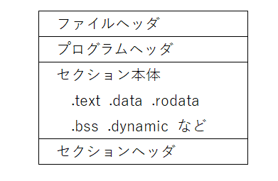

# day04
## 4.1 make入門（osbook_day04a）
- makeとは、コンパイルやリンクなどの作業を自動化するツールである。
- makeを構成するのは、makeコマンドと指示書であるMakefileである。
- 「第3章 画面表示の練習とブートローダ」で登場したカーネルのコンパイラとリンクをMakefileで表現すると以下のようになる。
    ```
    TARGET = kernel.elf
    OBJS = main.o
    
    CXXFLAGS += -O2 -Wall -g --target=x86_64-elf -ffreestanding -mno-red-zone \
          -fno-exceptions -fno-rtti -std=c++17
    LDFLAGS  += --entry KernelMain -z norelro --image-base 0x100000 --static
    
    
    .PHONY: all
    all: $(TARGET)
    
    .PHONY: clean
    clean:
          rm -rf *.O
    
    kernel.elf:$(OBJS) Makefile
          ld.lld $(LDFLAGS) -o kernel.elf $(OBJS)
    
    %.o: %.cpp Makefile
          clang++ $(CPPFLAGS) $(CXXFLAGS) -c $<
    ```
    - Makefileの前半が変数定義、後半がルールの定義になっている。変数は自由に定義して使用することができる。  
      上記のコードで使用している変数の意味は以下の通り。
        | 変数名 | 意味 | 
        | ------------- | -------- | 
        | TARGET | このMakefileが生成する最終成果物 |
        | OBJS | TARGETを作るのに必要なオブジェクトファイル群 |
        | CXXFLAGS | コンパイルオプション |
        | LDFLAGS | リンクオプション |
    - 変数定義の後にはルールが記載される。  
      ルールとは、ターゲットとその前提となる必須項目、必須項目からターゲットを生成するレシピ（コマンド列）を集めたもの。
    - 必須項目とは、ターゲットを作り出すために必要となるファイル群のこと。  
      レシピとは、必須項目からターゲットを作る実際の手順のこと。
    - 一つのルールは以下のような書き方で記載される。レシピの行は必ず先頭をタブ文字で始める必要がある。
      ```
      ターゲット:必須項目
          レシピ
      ```
- 上記のMakefileには、「all」「clean」「kernel.elf」「%.o」の4つのターゲットがある。  
  ターゲット名は、makeコマンドの引数に指定することができる。  
  make cleanを実行すると、main.oのファイルが削除される。  
  makeを引数なしで実行するとMakefileの最初に現れるターゲットであるallが指定されたのと同じ動きをする。
- ターゲットのうち、allとcleanは実際のファイル名ではなく、単にルールを表す名前として使っている。これらのターゲットのことを偽物のターゲット（phony target）と呼び、.PHONY宣言を行う。  
   .PHONY宣言は、allやcleanといったファイルが実在する場合に効果を発揮する。
- ルールは、次のように再帰的に処理が実行される。
    - すべての必須項目に対して、それぞれをターゲットとするルールを実行する。
    - その後、次の規則にしたがってレシピを処理する。
        - ターゲットが必須項目より新しい場合は、何もしない
        - ターゲットが実在しない or 必須項目より古い場合は、レシピを実行する
- allから始まって再帰的にルールが実行されるフローは以下の通り。
  ```
  all: kernel.elf
  -->必須項目（kernel.elf）のルール（kernel.elf: main.o Malefile）を実行。
      -->必須項目（main.o）のルール（main.0: main.cpp Malefile）を実行。
          -->必須項目（main.cpp）のルールを実行しようとするがないので何もしない。
          -->必須項目（Makefile）のルールを実行しようとするがないので何もしない。
          -->レシピを実行。clang++でmain.oを生成。
      -->必須項目（Makefile）のルールを実行しようとするがないので何もしない。
      -->レシピを実行。ld.lldでkernel.rlfを生成。
  -->レシピなし。何もしない。
  ```
- 何故かレシピがスキップされて必要なコマンドが実行されない場合は、以下のコマンドでファイルが新しいとか古いとかを無視してすべてのレシピを再実行させることができる。
  ```
  make -B
  ```
- Makefileの中の%.oや%.cppは、ファイル名のパターンである。パターンルールで統一して記載しておくと、OBJSに含まれるオブジェクトファイルが増えても記載を追加しなくて済む。%にあたる部分のことを「幹（stem）」という。
- レシピの中などで使用される特殊な変数がいくつかある。これらの変数はmakeが自動的に定義する変数である。主なものを以下に示す。
    | 変数名 | 説明 | 
    | ------------- | -------- |
    | \$< | 必須項目の先頭1つ |
    | \$^ | 必須項目すべてをスペース区切りで並べたもの |
    | \$@ | ターゲット（拡張子を含む） |
    | \$* | パターンルールにおける幹（stem） |
    - 「\$*」の実例を以下に示す。
        | ターゲットのパターン | 実際のターゲット | \$*の値 | 
        | ------------- | -------- | -------- | 
        | %.o | foo.o | foo |
        | a.%.b | dir/a.foo.b | dir/foo |
- %.oやkernel.elfのレシピ内でMakefileを使用していないが、必須項目にMakefileを指定している理由は、Makefileが更新された場合にはビルドをし直すべきだという考えがあるためである。Makefileを必須項目に登録しておけば、Makefileが更新された場合にレシピが再実行される。
## 4.2 ピクセルを自在に描く（osbook_day04b）
- 画面上の位置を指定して好きな色を描画できるような機能を開発する。
- ピクセル描画に必要な情報をまとめるためのFrameBufferConfig構造体の定義を以下に示す。
#### <frame_buffer_config.cpp（フレームバッファの構成情報を表す構造体）>
  ```
  #pragma once
    
  #include <stdint.h>
    
  enum PixelFormat {
    kPixelRGBResv8BitPerColor,
    kPixelBGRResv8BitPerColor,
  };
    
  struct FrameBufferConfig {
    uint8_t* frame_buffer;
    uint32_t pixels_per_scan_line;
    uint32_t horizontal_resolution;
    uint32_t vertical_resolution;
    enum PixelFormat pixel_format;
  };
  ```
  - FrameBufferConfig構造体は、以下の情報を保存する。
    | メンバ | 説明 | 
    | ------------- | -------- |
    | frame_buffer | フレームバッファ領域へのポインタ |
    | pixels_per_scan_line | フレームバッファの余白を含めた横方向のピクセル数 |
    | horizontal_resolution | 水平方向の解像度 |
    | vertical_resolution | 垂直方向の解像度 |
    | pixel_format | ピクセルのデータ形式 |
  - フレームバッファは3現職の光る強さを整数値で並べたものであり、フレームバッファにどういう色の順番でそれぞれ何ビットで並べるかということをpixel_formatが表している。
  - UEFIの規格ではピクセルのデータ形式は次の4種類がある。
  　- PixelRedGreenBlueReserved8BitPerColor
    - PixelBlueGreenRedReserved8BitPerColor
    - PixelBitMask
    - PixelBltOnly
  - 本プログラムでは、最初の2種類だけサポートすることとする。
  - ブートローダ側の変更は以下の通り。
#### <Main.c（ブートローダはOS本体に描画に必要な情報を渡す）>
```
struct FrameBufferConfig config = {
  (UINT8*)gop->Mode->FrameBufferBase,
  gop->Mode->Info->PixelsPerScanLine,
  gop->Mode->Info->HorizontalResolution,
  gop->Mode->Info->VerticalResolution,
  0
};
switch (gop->Mode->Info->PixelFormat) {
  case PixelRedGreenBlueReserved8BitPerColor:
    config.pixel_format = kPixelRGBResv8BitPerColor;
    break;
 case PixelBlueGreenRedReserved8BitPerColor:
    config.pixel_format = kPixelBGRResv8BitPerColor;
    break;
 default:
    Print(L"Unimplemented pixel format: %d\n", gop->Mode->Info->PixelFormat);
    Halt();
}

typedef void EntryPointType(const struct FrameBufferConfig*);
EntryPointType* entry_point = (EntryPointType*)entry_addr;
entry_point(&config);
```
 - UEFIのGOPから取得した情報を、先ほど作った構造体にコピーして、その構造体へのポインタをKernelMain()の引数に渡す。
-カーネル側の変更は以下の通り。
#### <main.cpp（WritePixel()を使って画面を描画する）>
```
extern "C" void KernelMain(const FrameBufferConfig& frame_buffer_config) {
  for (int x = 0; x < frame_buffer_config.horizontal_resolution; ++x) {
    for (int y = 0; y < frame_buffer_config.vertical_resolution; ++y) {
      WritePixel(frame_buffer_config, x, y, {255, 255, 255});
    }
  }
  for (int x = 0; x < 200; ++x) {
    for (int y = 0; y < 100; ++y) {
      WritePixel(frame_buffer_config, 100 + x, 100 + y, {0, 255, 0});
    }
  }
  while (1) __asm__("hlt");
}
```
 - 引数で構造体のポインタを参照（const FrameBufferConfig&）で受け取っている。参照型はC++固有の文法で、C言語にはない。参照型の引数を持つ関数をC言語から呼び出すには、参照の代わりにポインタを指定すればよい。  
   これはC++自体の仕様ではなく、 使用しているコンパイラの仕様であるSystem V AMD64 ABIで決まっている。
- 指定したピクセル座標描画する関数のWritePixel()の実装を以下に示す。
#### <main.cpp（WritePixel()）>
```
struct PixelColor {
  uint8_t r, g, b;
};

/** WritePixelは1つの点を描画します．
 * @retval 0   成功
 * @retval 非0 失敗
 */
int WritePixel(const FrameBufferConfig& config,
               int x, int y, const PixelColor& c) {
  const int pixel_position = config.pixels_per_scan_line * y + x;
  if (config.pixel_format == kPixelRGBResv8BitPerColor) {
    uint8_t* p = &config.frame_buffer[4 * pixel_position];
    p[0] = c.r;
    p[1] = c.g;
    p[2] = c.b;
  } else if (config.pixel_format == kPixelBGRResv8BitPerColor) {
    uint8_t* p = &config.frame_buffer[4 * pixel_position];
    p[0] = c.b;
    p[1] = c.g;
    p[2] = c.r;
  } else {
    return -1;
  }
  return 0;
}
```
 - WritePixel()は、指定したピクセル座標(xとy)に指定した色(c)を描画する関数である。ピクセルのデータ形式に基づいて、光の3原色をフレームバッファに書き込む。
 - pixel_positionには、ピクセルの座標をフレームバッファ先頭からの位置に変換した値が設定される。  
   以下の式から、座標をフレームバッファ先頭からの位置に変換する。
   - 座標をフレームバッファ先頭からの位置 = (余白を含めた横方向のピクセル数 * y) + x
 - ピクセル座標とフレームバッファ先頭からの位置の関係は以下の通り。

   　 
 - PixelRedGreenBlueReserved8BitPerColorとPixelBlueGreenRedReserved8BitPerColorは両方とも各色8ビットで表されるが、色の並びが異なる。  
   前者は赤→緑→青→予約領域、後者は青→緑→赤→予約領域となる。
 - 予約領域は8ビットで構成される。原色の3色だけでは24ビット(3バイト)と中途半端になるため、8ビットの予約領域を追加して32ビット(4バイト)にそろえている。
 - 1ピクセルは32ビットすなわち4バイトなので、あるピクセル座標の位置をフレームバッファ先頭からの計算するには、ピクセルとしての位置（pixel_position)に4を掛ける。
 - 上記のコードでは、まず画面全体を白（255,255,255）で塗りつぶした後に、200×100の緑色の四角形を描画している。  
   実行結果は以下の通り。
   
   　 

## 4.3 C++の機能を使って書き直す（osbook_day04c）
- ここでは、C++の言語機能である仮想関数を使って、WritePixel()相当の機能を持ちつつ、関数の外側でピクセルのデータ形式を判定するように変更する。
- C++のクラスを使ってコードを変更する。クラスはデータとその操作をひとまとまりにしたもので、クラスのようにデータとそれを操作する手続きを合わせたものを抽象データ型という。抽象データ型は、外部のユーザからデータの中身の詳細を隠蔽し、外部に公開された手続きによる操作を強制することで、インターフェースと実装を分離できるという特徴がある。
- クラスを使うことで、ピクセルのデータ形式に依存しない「ピクセル描画インターフェース」と「ピクセルのデータ形式にしたがって実際に描画する実装」を分離する。
  #### <main.cpp（PixelWriterクラスの実装（親クラス））>
  ```
  class PixelWriter {
   public:
    PixelWriter(const FrameBufferConfig& config) : config_{config} {
    }
    virtual ~PixelWriter() = default;
    virtual void Write(int x, int y, const PixelColor& c) = 0;

   protected:
    uint8_t* PixelAt(int x, int y) {
      return config_.frame_buffer + 4 * (config_.pixels_per_scan_line * y + x);
    }

   private:
    const FrameBufferConfig& config_;
  };
  ```
  - 上記はインターフェースにあたる部分のソースコードで、PixelWriterクラスを1つ定義している。
  - このクラスはピクセルを描画するためのWriter()関数を含む。この関数のプロトタイプ宣言の後ろに"= 0"があるのは、この関数が純粋仮想関数であることを表している。純粋仮想関数は、実際の処理の内容は決まっていないけど、戻り値と引数の仕様、関数名は決まっている関数である。子クラスで処理の実装をオーバーライドすることもある。
  - 戻り値の型が何も書いていない、クラス名と同じ名前のPixelWriter()関数はコンストラクタと呼び、クラスのインスタンスをメモリ上に構築するために呼ばれるのがコンストラクタである。
  - 頭に"\~"がある~PixelWriter()関数はデストラクタと呼び、インスタンスを破棄する際に呼ばれる。
  - コンストラクタPixelWriter::PixelWriterはフレームバッファの構成情報を受け取り、クラスのメンバ変数config_にコピーする。構成情報をコンストラクタで受け取っておくことでPixelWriter::Write()を呼び出す際に構成情報を渡す必要がなくなる。
  #### <main.cpp（PixelWriterクラスを継承したクラス群（子クラス））>
  ```
  class RGBResv8BitPerColorPixelWriter : public PixelWriter {
   public:
    using PixelWriter::PixelWriter;

    virtual void Write(int x, int y, const PixelColor& c) override {
      auto p = PixelAt(x, y);
      p[0] = c.r;
      p[1] = c.g;
      p[2] = c.b;
    }
  };

  class BGRResv8BitPerColorPixelWriter : public PixelWriter {
   public:
    using PixelWriter::PixelWriter;

    virtual void Write(int x, int y, const PixelColor& c) override {
      auto p = PixelAt(x, y);
      p[0] = c.b;
      p[1] = c.g;
      p[2] = c.r;
    }
  };
  ```
  - 上記は、インターフェースに対する実装に相当する部分のソースコードである。
  - インターフェースであるPixelWrterクラスを継承して、2種類のピクセル形式それぞれに対応するRGBResv8BitPerColorPixelWriterクラスとBGRResv8BitPerColorPixelWriterクラスを定義している。
  - 継承とは、あるクラスを基にして機能の差分を書くやり方の1つで、今回は、基となるPixelWriterクラスのWrite()に実装を与えるために継承している。親クラスの関数を子クラスで上書きすることをオーバーライドと呼ぶ。
  - 2つのクラスにはコンストラクタの定義が見当たらないが、using宣言によって、親クラスのコンストラクタをそのまま子クラスのコンストラクタとして使うことができる。
  #### <main.cpp（PixelWriterクラスの使用）>
  ```
  char pixel_writer_buf[sizeof(RGBResv8BitPerColorPixelWriter)];
  PixelWriter* pixel_writer;
  
  extern "C" void KernelMain(const FrameBufferConfig& frame_buffer_config) {
    switch (frame_buffer_config.pixel_format) {
      case kPixelRGBResv8BitPerColor:
        pixel_writer = new(pixel_writer_buf)
          RGBResv8BitPerColorPixelWriter{frame_buffer_config};
        break;
      case kPixelBGRResv8BitPerColor:
        pixel_writer = new(pixel_writer_buf)
          BGRResv8BitPerColorPixelWriter{frame_buffer_config};
        break;
    }

    for (int x = 0; x < frame_buffer_config.horizontal_resolution; ++x) {
      for (int y = 0; y < frame_buffer_config.vertical_resolution; ++y) {
        pixel_writer->Write(x, y, {255, 255, 255});
      }
    }
    for (int x = 0; x < 200; ++x) {
      for (int y = 0; y < 100; ++y) {
        pixel_writer->Write(x, y, {0, 255, 0});
      }
    }
    while (1) __asm__("hlt");
  }
  ```
  - 上記は定義したクラスを使っている部分のソースコードである。pixel_writerとpixel_writer_bufは、グローバル変数である。
  - このプログラムではまず、ピクセルのデータ形式に基づいて、2つの子クラスの適する方のインスタンスを生成し、そのインスタンスへのポインタをpixel_writer変数に設定する。その後、pixel_writerを使って1度画面を白に塗りつぶしたあと、200×100の緑の四角を描画する。
  - newの使い方について記載する。一般的なnewの使い方は、「new クラス名」で、引数は取らない。一般のnewは指定したクラスのインスタンスをヒープ領域に生成する。ヒープ領域は、関数の実行が終了しても破壊されない領域であり、関数を抜けても生存する必要があるデータはnew演算子で確保する。new演算子やmalloc()を使わず普通に定義した変数はスタック領域に配置される。スタック領域に配置された変数は、その変数が定義されたブロックを抜けると破棄される。  
    new演算子は、メモリ領域を確保した後にコンストラクタを呼び出す。クラスのコンストラクタをプログラマが明示的に呼び出す方法はないので、クラスのインスタンスを作るにはnew演算子を使うしか方法がない。  
    一般のnewは変数をヒープに確保するといったが、これはOSがメモリを管理できるようになって初めて可能になる。メモリ管理がない場合でもクラスのインスタンスを作成するには、配置newを使う。配置newはメモリの確保を行わず、その代わりに引数に指定したメモリ領域上にインスタンスを生成する。そのメモリ領域に対してコンストラクタを呼び出す。OSにメモリ管理機能がなくても、配列を使えば好きな大きさのメモリを確保することができるので、配列と配置newを組み合わせることでクラスのインスタンス生成が可能になる。
    #### <main.cpp（配置newの演算子の定義）>
    ```
    void* operator new(size_t size, void* buf) {
      return buf;
    }
  
    void operator delete(void* obj) noexcept {
    }
    ```
    - 配置newは、\<new\>をインクルードするか、自分で定義する必要がある。上記に配置newの実装を記載する。
    - C++ではoperatorキーワードを使うと演算子を定義することができる。一般のnewの引数はsizeだけだが、配置newでは追加の引数があり、そこにメモリ領域へのポインタが渡される。配置newはメモリ領域自体の確保は必要ないので、引数で受け取ったメモリ領域へのポインタbufをそのまま返すだけでよい。
    - operator deleteの方は配置newとは関係ない、普通のdelete演算子である。deleteは使用していないが、~PixelWriter()が子の演算子を要求するようなので定義している。 
  - 配置newを使って生成した子クラスのインスタンスへのポインタを親クラスPixelWriterを指すポインタ型であるpixel_writerに代入する、継承関係がある2つのクラスでは、子クラスのポインタを親クラスのポインタに代入することで、あたかも親クラスであるかのように子クラスを操作することができる。
 
    

## 4.5 ローダを改良する（osbook_day04d）
- 本来、ローダはカーネルファイルに記録された情報を元にメモリの大きさを決める必要がある。
- kernel.elfのフォーマットであるELF形式は、以下のようにファイルヘッダ、プログラムヘッダ、セクション本体、セクションヘッダに分けられる。  
  
  - ファイルヘッダは、ファイル全体の情報が記載されている。例えばELFファイルのビット数、対象アーキテクチャ、プログラムヘッダやセクションヘッダの開始位置やサイズなどが記載されている。
  - プログラムヘッダは、ローダ向けの情報が記載されている。
  - セクションヘッダは、リンカ向けの情報で、各セクションでの位置とサイズ、セクションの属性などが記載されている。
- ELF形式では、メモリへの読み込みに関する情報はプログラムヘッダに記載されている。  
  プログラムヘッダを確認するには、readelf -l コマンドを使用する。  
  
  - PHDRやLOAD、GNU_STACKなどはセグメントと呼ばれるまとまりで、セグメントはELF形式のファイルの一部分である。セグメントごとにファイル上でのオフセットと大きさ、メモリ上でのオフセットと大きさ、メモリ属性を持つ。これらのセグメント情報を基にローダはファイルをメモリ上に読み込む。
  - ローダは、LOADセグメントに記載された情報に従って、ファイルのデータをメモリにコピーする。このような処理をロードという。
  - readelf -l コマンドで読み出したLOADセグメントの情報を整理すると以下の通りになる。
    | オフセット | 仮想Addr | ファイルサイズ | メモリサイズ | フラグ | 
    | ---------- | -------- | ------------- | ------------ | ------ |
    | 0x0000 | 0x100000 | 0x01a8 | 0x01a8 | R   |
    | 0x1000 | 0x101000 | 0x01b9 | 0x01b9 | R E |
    | 0x2000 | 0x102000 | 0x0000 | 0x0018 | RW  |
    - 仮想アドレスが0x100000から始まっているのは、ld.lldのオプションに「--image-base 0x100000」を指定したからである。
    - 3つ目のLOADセグメントは、ファイル上でのサイズとメモリ上でのサイズが異なる。その理由は、3つ目のLOADセグメントには.bssセクションが含まれているからである。.bssセクションとは、通常、初期値なしのグローバル変数が配置されるセクションである。初期値が無いので、ファイルに記録しておく必要がないため、ファイル上での大きさは0、メモリ上では大きさを持つ変数となる。
  - 3つのLOADセクションを以下のようにメモリ上へ読み込めば良い。
      
- 64ビット用ELFのファイルヘッダは以下のような構造になっている。
  #### <elf.hpp（64ビットELFのファイルヘッダ）>
  ```
  #define EI_NIDENT 16
  
  typedef struct {
  　unsigned char e_ident[EI_NIDENT];
  　Elf64_Half    e_type;
  　Elf64_Half    e_machine;
  　Elf64_Word    e_version;
  　Elf64_Addr    e_entry;
  　Elf64_Off     e_phoff;    // プログラムヘッダのファイルオフセット
  　Elf64_Off     e_shoff;
  　Elf64_Word    e_flags;
  　Elf64_Half    e_ehsize;
  　Elf64_Half    e_phentsize;    // プログラムヘッダの要素1つの大きさ
  　Elf64_Half    e_phnum;        // プログラムヘッダの要素数
  　Elf64_Half    e_shentsize;
  　Elf64_Half    e_shnum;
  　Elf64_Half    e_shstrndx;
  } Elf64_Ehdr;
  ```
  - e_phoffがプログラムヘッダのファイルオフセットを表す項目である。このファイル領域を読めばプログラムヘッダを取得できる。
  - プログラムヘッダは配列になっていて、e_phentsizeは要素1つの大きさを表し、e_phnumは要素数を表す。

- プログラムヘッダの各要素は以下のような構造体になっている。
  #### <elf.hpp（64ビットELFのプログラムヘッダの要素）>
  ```
  typedef struct {
  　Elf64_Word  p_type;      // PHDR、LOADなどのセグメント種別
  　Elf64_Word  p_flags;     // フラグ
  　Elf64_Off   p_offset;    // オフセット
  　Elf64_Addr  p_vaddr;     // 仮想Addr
  　Elf64_Addr  p_paddr;
  　Elf64_Xword p_filesz;    // ファイルサイズ
  　Elf64_Xword p_memsz;     // メモリサイズ
  　Elf64_Xword p_align;
  } Elf64_Phdr;
  ```
- 以上を踏まえてローダの改造方針は以下とする。
  1. kernel.elfを一時領域に読み込む。
  2. 一時領域に読み込んだカーネルファイルのプログラムヘッダを読み、最終目的地の番地の範囲を取得する。
  3. 一時領域から最終目的地へ、LOADセグメントをコピーし、一時領域を削除する。
- 上記の方針に従って、まずはカーネルファイルを一時的に読み込む処理を作成する。コードは以下。
  #### <Main.c（カーネルファイルを一時領域に読み込み）>
  ```
  EFI_FILE_INFO* file_info = (EFI_FILE_INFO*)file_info_buffer;
  UINTN kernel_file_size = file_info->FileSize;

  VOID* kernel_buffer;
  status = gBS->AllocatePool(EfiLoaderData, kernel_file_size, &kernel_buffer);
  if (EFI_ERROR(status)) {
    Print(L"failed to allocate pool: %r\n", status);
    Halt();
  }
  status = kernel_file->Read(kernel_file, &kernel_file_size, kernel_buffer);
  if (EFI_ERROR(status)) {
    Print(L"error: %r", status);
    Halt();
  }
  ```
  - gBS->AllocatePool()は、カーネルファイルを読み込むための一時領域確保に使用する。この関数は、gBS->AllocatePages()と異なってページ単位ではなくバイト単位でメモリを確保する。その代わり、確保する場所を指定する機能がない。今回はカーネルファイルを一時的に読み込むために使用するため、場所の指定は不要である。
  - gBS->AllocatePool()の第1引数に確保するメモリ領域の種別を指定する。ブートローダが使う領域の場合は普通EfiLoaderDataを指定する。([[3.3 初めてのカーネル（osbook_day03a）]](https://github.com/RRRYOOO/OS/blob/main/mikanOS/day03/day03.md#mainc%E3%83%95%E3%82%A1%E3%82%A4%E3%83%AB%E6%83%85%E5%A0%B1%E3%81%AE%E6%A7%8B%E9%80%A0%E4%BD%93)より) 
  - gBS->AllocatePool()が成功すると、kernel_bufferには確保されたメモリ領域の先頭アドレスが格納される。そのアドレスをkernel_file->Readに指定することで、カーネルファイルの内容をすべて一時領域へ読み込むことができる。
- 次に最終目的地の番地の範囲を取得して、コピー先のメモリを確保する。
  #### <Main.c（コピー先のメモリ領域の確保）>
  ```
  Elf64_Ehdr* kernel_ehdr = (Elf64_Ehdr*)kernel_buffer;
  UINT64 kernel_first_addr, kernel_last_addr;
  CalcLoadAddressRange(kernel_ehdr, &kernel_first_addr, &kernel_last_addr);

  UINTN num_pages = (kernel_last_addr - kernel_first_addr + 0xfff) / 0x1000;
  status = gBS->AllocatePages(AllocateAddress, EfiLoaderData,
                              num_pages, &kernel_first_addr);
  if (EFI_ERROR(status)) {
    Print(L"failed to allocate pages: %r\n", status);
    Halt();
  }
  ```
  - 最終目的地の番地の範囲とは、具体的には0x100000から始まるアドレスの範囲のこと。
  - CalcLoadAddressRange()が範囲を計算し、範囲の開始アドレスを変数kernel_first_addrに、終了アドレスを変数kernel_last_addrに設定する。
  - それらを使って必要なメモリ領域の大きさをページ単位で計算し、メモリを確保する。  
    （0xffffを足しこんでいる理由は以下を復習のこと。[[3.3 初めてのカーネル（osbook_day03a）]](https://github.com/RRRYOOO/OS/blob/main/mikanOS/day03/day03.md#mainc)）
  - CalcLoadAddressRange()の実装は以下の通り。
    #### <Main.c（CalcLoadAddressRange()の実装）>
    ```
    void CalcLoadAddressRange(Elf64_Ehdr* ehdr, UINT64* first, UINT64* last) {
      Elf64_Phdr* phdr = (Elf64_Phdr*)((UINT64)ehdr + ehdr->e_phoff);
      *first = MAX_UINT64;
      *last = 0;
      for (Elf64_Half i = 0; i < ehdr->e_phnum; ++i) {
        if (phdr[i].p_type != PT_LOAD) continue;
        *first = MIN(*first, phdr[i].p_vaddr);
        *last = MAX(*last, phdr[i].p_vaddr + phdr[i].p_memsz);
      }
    }
    ```
    - この関数は、カーネルファイル内のすべてのLOADセグメントをfor文で順番に確認していき、開始アドレス(first)と終了アドレス(last)を更新していく。その際、変数firstを絶対に現れない大きな値(MAX_UINT64)で、lastを絶対現れない小さな値(0)で初期化しておき、比較・更新を行う。
    - phdrはプログラムヘッダの配列を指すポインタで、phdr[i]はi番目のプログラムヘッダを表す。p_typeを確認し、それがLOADセグメントである場合のみ処理を実行し、それ以外の場合はスキップする。
    - プログラムヘッダ内のp_vaddrが各セグメントの開始アドレスに相当し、p_vaddr + p_memszが終了アドレスに相当する。for文で各セグメントのプログラムヘッダを確認して、処理完了時にはp_vaddrの最小値がfirstに、p_vaddr + p_memszの最大値がlastに設定される。firstとlastに挟まれた範囲を1つのセグメントとみなして、そのサイズ分（ページ単位）だけのメモリ領域を確保する。
- 次に一時領域から最終目的地へLOADセグメントをコピーする。
  #### <Main.c（Loadセグメントのコピー）>
  ```
  CopyLoadSegments(kernel_ehdr);
  Print(L"Kernel: 0x%0lx - 0x%0lx\n", kernel_first_addr, kernel_last_addr);

  status = gBS->FreePool(kernel_buffer);
  if (EFI_ERROR(status)) {
    Print(L"failed to free pool: %r\n", status);
    Halt();
  }
  ```
  - CopCopyLoadSegments()を呼び出してLoadセグメントを最終目的地にコピーする。その後に実行しているg->FreePool()は一時領域を解放するための処理。
  - CopCopyLoadSegments()の実装は以下。
    #### <Main.c（CopCopyLoadSegments()の実装）>
    ```
    void CopyLoadSegments(Elf64_Ehdr* ehdr) {
      Elf64_Phdr* phdr = (Elf64_Phdr*)((UINT64)ehdr + ehdr->e_phoff);
      for (Elf64_Half i = 0; i < ehdr->e_phnum; ++i) {
        if (phdr[i].p_type != PT_LOAD) continue;

        UINT64 segm_in_file = (UINT64)ehdr + phdr[i].p_offset;
        CopyMem((VOID*)phdr[i].p_vaddr, (VOID*)segm_in_file, phdr[i].p_filesz);

        UINTN remain_bytes = phdr[i].p_memsz - phdr[i].p_filesz;
        SetMem((VOID*)(phdr[i].p_vaddr + phdr[i].p_filesz), remain_bytes, 0);
      }
    }
    ```
    - この関数は、一時領域のLOADセグメントを最終目的地にコピーを行う。
    -  phdrはプログラムヘッダの配列を指すポインタで、phdr[i]はi番目のプログラムヘッダを表す。p_typeを確認し、それがLOADセグメントである場合のみ以下の処理を実行し、それ以外の場合はスキップする。  
      1. segm_in_fileが指す一時領域からp_vaddrが指す最終目的地へデータをコピーする。（CopyMem()）
      2. セグメントのメモリ上のサイズがファイル上のサイズより大きい場合（remain_bytes > 0）、残りを0で埋める。（SetMem()）。
  - 最終目的地へすべてのLOADセグメントをコピーし終えたら、コピー先からエントリポイントを取得する。 
    #### <Main.c（エントリポイントの取得）>
    ```
    UINT64 entry_addr = *(UINT64*)(kernel_first_addr + 24); 
    ```
    - EFI形式ファイルは仕様書によると、64ビット用のELFのエントリポイントアドレスは、カーネルファイルを展開したメモリ領域の先頭アドレスから24バイトオフセットした位置に8バイトの整数として格納されることになっている。([[3.3 初めてのカーネル（osbook_day03a）]](https://github.com/RRRYOOO/OS/blob/main/mikanOS/day03/day03.md#mainc%E3%82%AB%E3%83%BC%E3%83%8D%E3%83%AB%E3%81%AE%E8%B5%B7%E5%8B%95)より) 
      
  
## その他
### make実行時に「 fatal error: 'cstdint' file not found」のエラーが発生する場合
- 以下のコマンドを実行して、makeを実行する。
  ```
  source $HOME/osbook/devenv/buildenv.sh
  ```
  - 自作OSで<cstdint>を使うには、\<cstdint\>のありかをClangに伝える必要がある。それを手軽に行うためにbuildenv.shというスクリプトファイルが準備されている。このスクリプトをsourceコマンドで実行する。（day03より）   
 

