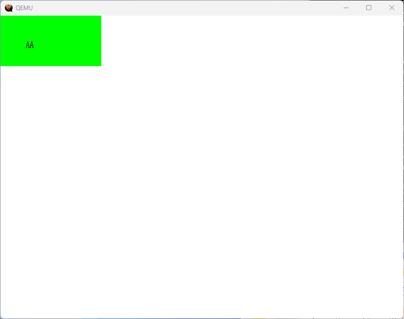

# day05
## 5.1 文字を書いてみる（osbook_day05a）
- 文字を画面に表示するには、文字の部分だけを塗り、それ以外を塗らないという処理をする。
- まずは、「A」を描画するために黒く塗る部分を1、塗らない部分を0としたデータを用意する。
  #### <main.cpp（'A'のフォントデータを定義）>
  ```
  const uint8_t kFontA[16] = {
    0b00000000,   //
    0b00011000,   //   **   
    0b00011000,   //   **   
    0b00011000,   //   **   
    0b00011000,   //   **   
    0b00100100,   //  *  *  
    0b00100100,   //  *  *  
    0b00100100,   //  *  *  
    0b00100100,   //  *  *  
    0b01111110,   // ****** 
    0b01000010,   // *    * 
    0b01000010,   // *    * 
    0b01000010,   // *    * 
    0b11100111,   //***  ***
    0b00000000,   //
    0b00000000,   //
  };
  ```
  - 上記のように字形を表すデータをフォントと呼ぶ。プログラミング的には、フォントの大きさが2のべき乗だと扱いやすいので、今回は横8ピクセル、縦16ピクセルでフォントを用意する。
  - フォントは塗るか、塗らないかを表せば十分なので、1ピクセルは1ビットで表せる。
- フォント描画用の関数を以下に示す。
  #### <main.cpp（フォント描画用の関数）>
  ```
  void WriteAscii(PixelWriter& writer, int x, int y, char c, const PixelColor& color) {
    if (c != 'A') {
      return;
    }
    for (int dy = 0; dy < 16; ++dy) {
      for (int dx = 0; dx < 8; ++dx) {
        if (kFontA[dy] << dx & 0x80u) {
          writer.Write(x + dx, y + dy, color);
        }
      }
    }
  }
  ```
  - この関数は、引数としてASCIIコードを受け取り、その文字に対応するフォントを指定された位置に描画する。
  - 外側のfor文で縦方向について回し、内側のfor文では横方向について回す。
  - フォントデータの横1行分のデータは8ビット整数で、最大ビット（ビット7）が文字の左端、最小ビット（ビット0）が文字の右端に該当する。8ビット整数を左にビットシフトしながら、最上位ビットが1の場合は塗る、0の場合は塗らないとfor文を進めていく。
  -  引数のcolorで描画する色を指定できる。
- フォント描画を行う関数をkernelMain()に追加する。
  #### <main.cpp（フォント描画関数を追加）>
  ```
  WriteAscii(*pixel_writer, 50, 50, 'A', {0, 0, 0});
  WriteAscii(*pixel_writer, 58, 50, 'A', {0, 0, 0});
  ```
  - WriteAscii()内部でピクセルを描画する必要があるため、引数としてPixelWriterクラスへの参照を要求する。
- 実行結果は以下のとおり。  
  
## 5.2 分割コンパイル（osbook_day05b）
- 現状のmain.cppに書かれているコードを以下のように分割する。
  | ファイル | 内容 | 
  | ------------ | --------------------- |
  | graphics.cpp | 画像処理に関するコードを書くファイル。PixelWriterクラスなどはここに格納する。 | 
  | font.cpp | フォントに関するコードを書くファイル。WriterAscii()などはここに格納する。  |
  | main.cpp | メイン関数を格納するファイル。 |
## 5.3 フォントを増やす（osbook_day05c）
- 現状、\'A\'のフォントしかないので、フォントを増やす。フォントを1つ1つ作るのは大変なので、8×16の英数字フォントの「東雲フォント」のデータを加工したhankaku.txtを使用する。以下にhankaku.txtの中身の一例を示す。
  #### <hankaku.txt（東雲フォントの加工データ）>  
  ```
    ・
    ・
    ・
  0x41 'A'
  ........
  ...@....
  ...@....
  ..@.@...
  ..@.@...
  ..@.@...
  .@...@..
  .@...@..
  .@...@..
  .@@@@@..
  @.....@.
  @.....@.
  @.....@.
  @.....@.
  ........
  ........
  
  0x42 'B'
  ........
  @@@@....
  @...@...
  @....@..
  @....@..
  @....@..
  @...@...
  @@@@@...
  @....@..
  @.....@.
  @.....@.
  @.....@.
  @....@..
  @@@@@...
  ........
  ........
  
    ・
    ・
    ・
  ```
- hankaku.txtをOSから使えるようにする必要がある。やり方はいろいろある。（参考：[バイナリファイルの埋め込みかた](http://elm-chan.org/junk/32bit/binclude_j.html)）
- 今回は、カーネルファイルに直接組み込む方法で実現することとする。そうすれば、OS起動直後からフォントデータを利用することができる。
- hankaku.txtのままでは扱いにくいので、前回用意したkFontA同様に配列形式に変換してから埋め込む。つまり1文字あたり16バイトのバイナリデータにする。テキストデータからバイナリデータに変換するのは大変なので、著者作成の変換ツール"makefont.py"を使用する。
- 以下のコマンドでテキストデータからバイナリデータに変換する。
  ```
  $ ../tools/makefont.py -o hankaku.bin hanakaku.txt
  ```
- 次に、objcopyコマンドを使ってバイナリファイルをリンク可能なオブジェクトファイルに変換する。
- 以下のコマンドでバイナリファイルをオブジェクトファイルに変換する。
  ```
  $ objcopy -I binary -O elf64-x86-64 -B i386:x86-64 hankaku.bin hankaku.o
  ```
  - 入力がベタのバイナリなので、"-I binary"でそのことを明示する必要がある。
  - コマンド実行後に、 hankaku.oが生成される。このファイルをmain.oなどと一緒にリンクすると、プログラムの中から変数として使えるようになる。
- 組み込まれたデータの開始アドレス、終了アドレス+1、サイズは、objcopyがファイル名を元にしてそれぞれ"_binary_hankaku_bin_start"、"_binary_hankaku_bin_end"、"_binary_hankaku_bin_size"というシンボルを生成するので、Cコードからはその名称で参照する。
- 変数を使ってフォントデータを取得する関数GetFont()を以下のように定義する。
  #### <font.cpp（指定した文字のフォントデータ格納先アドレスを取得）>  
  ```
  
  ```
